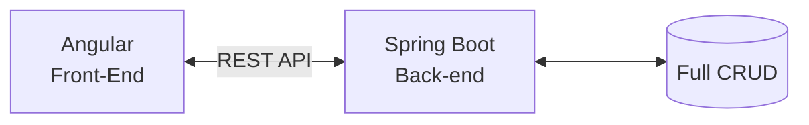

# Welcome to my 'angular-spring-boot' repo!

20260225
```java
@RestController
@RequestMapping("/api")
```

1. Angular overview
2. Set up development environment
3. TypeScript
4. Deeper dive into Angular
5. eCommerce App

