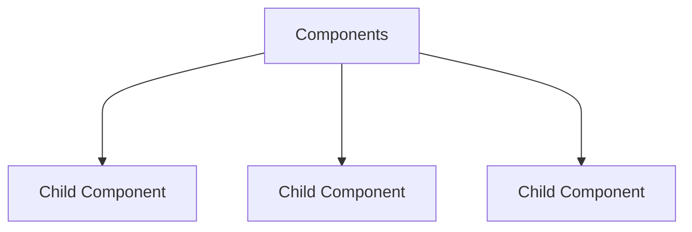
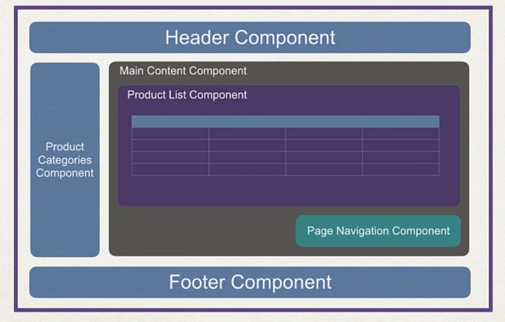
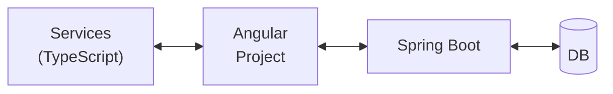

# Angular

[www.angular.io](www.angular.io)

Angular is a framework for building modern **single-page
applications**.

## Single-Page vs Traditional Application

### Traditional Applications

Every single user action results in a full HTML page load.

### Single-Page Applications

- A single-page web application is composed, naturally, of
a single page that is updated based on user actions.

- Single-page applications usually perform a 
**partial update**, instead of a full page reload.

- The single-page app can communicate with the server using
a REST API for data exchange.

### Examples of Single-Page web apps:

1. Google Maps
2. Gmail (most email web applications)

## Angular Solutions

- Australian Government: Immigration
- Microsoft Xbox
- Citi Bank Customer Service

[www.madewithangular.com](www.madewithangular.com)

## Angular History

October 2010 --> AngularJS 1.0   
October 2016 --> **Angular 2**. Full rewrite of AngularJS.

Angular 4, 5, 6, 7, 8 are incremental improvements of Angular 2.

Major release every 6 months.

2022 -> Angular 15  
2023 -> Angular 16  
...  
2026 -> Angular 21  

Could I not just do everything myself with **JavaScript, jQuery,
AJAX**, etc.?  
It may work for small basic hobby apps, but for common features
such as **data binding**, you may reinvent the wheel.  
Plus, it would be hard to manage and mantain for **enterprise
real-time applications**.

This is actually the main reason why we have frameworks such
as **Angular, React.js, Vue.js, ...**

# Development Environment Setup

- Most Angular developers use TypeScript (Superset of JS)

|  Tool   |   Purpose  |
| :---    | :---       |
| `node`  | Running JavaScript code from the command-line.  |
| `npm`   | Node Package Manager -> Download new node packages and features. Similar to `maven`.  |
| `tsc`   | TypeScript compiler.   |
| `nvm`   | Node Version Manager -> Allows to have multiple versions of Node installed  |

[www.luv2code.com/angular-install-guides](www.luv2code.com/angular-install-guides)

## Software to be Installed

- Visual Studio Code
- nvm 0.35.0 (manage multiple Node versions)
- node 16.10.0 (includes npm)
- npm 7.24.0 (you can use this to install tsc)
- tsc 4.6.4
- Angular 14
- Spring Boot 2.7.1

### Installation (basic guideline)

```bash
# Install Node Version Manager
curl -o- https://raw.githubusercontent.com/creationix/nvm/v0.35.0/install.sh | bash
# Verify
nvm --version

# Install Node (includes npm)
nvm install node
# Verify
node --version
npm --version

# Install tsc
# -g = global package; tsc will be available for all
# directories of the current user
npm install -g typescript@4.6.4

# Verify tsc installation
tsc --version
```

# TypeScript Overview

TypeScript is a PL built on top of JavaScript, developed
by Microsoft in 2012.  
TypeScript provides static typing support for JavaScript.  
TypeScript adds support for OOP.

[Official TypeScript Documentation](www.typescriptlang.org)

## Angular Development (TypeScript!)

Angular allows you to develop in the following languages

- JavaScript
- ECMAScript (ES6, ES9, ...)
- **TypeScript**
- Dart

However, **TypeScript** is the most popular language for
Angular Development, because TypeScript is a strongly-typed
language with **compile time checking** and IDE support.
In fact, the Angular framework itself is developed with
TypeScript.

```latex
JavaScript \subset ECMAScript \subset TypeScript
```

TypeScript file extension = `*.ts`

- Web browsers do not understand TypeScript natively.
Thus, it is necessary to convert, or **transpile** TypeScript
code into JavaScript code.

By using the `tsc`:  
`mydemo.ts` ---> `mydemo.js`

```bash
# Transpile the source code
tsc mydemo.ts
# Generates "mydemo.js"

# Run the *.js code
node mydemo.js
```

`tsc` can find errors earlier, at compilation time, instead
of at runtime.

### *Careful

Even if your code has syntax errors, tsc will still generate
a *.js file. To prevent this, add this:

```bash
tsc -noEmitOnError file.ts
```

# Angular Features (After TypeScript Training)

- The Angular framework is a **component-based framework**.
- Clean separation between template coding and application
logic.
- Built-in support for **data-binding** and dependency injection.
- Supports responsive web design and modern frameworks  
(Bootstrap, Google Material Design (Angular Material), ...)

# Angular Architecture



- "Components" can make use of "View Templates" ---> 
"Directives" (to modify the behavior of these templates).

- You can also write "Services" as a client-side code.
- Modules -> Collection of related components, services,
directives, etc.

# Key Terms in Angular Development

| Term    | Definition |
| :---:   | :---       |
| **Component** | Main player in an Angular applications. It has two parts:</br>1. View for the user interface.</br>2. Class that contains the application logic/event handling for the view. |
| **View Template** | The user interface for the component.</br>Static HTML + dynamic elements. |
| **Directive** | Adds custom behavior to HTML elements.</br> Used for looping, conditionals, etc.  |
| **Service** (TypeScript) | A helper class that provides the desired functionality.</br>Retrieving data from a server, performing a calculation or validation and so on. |
| **Module** | A collection of related components, directives, services, etc. |

# Application UI Composition Example



# Application Interaction



# Creating an Angular Project

[http://cli.angular.io](http://cli.angular.io)

CLI = Command-Line Interface

## Installing the Angular CLI (`ng`)

```bash
npm install --location=global @angular/cli@14.0.7
ng version
ng help
```

## Creating a New Angular Project

```bash
# ng new <new-project_name>
ng new my-first-angular-project
```

## Run the Project: `ng serve`

1. Build the app (compile/transpile).
2. Starts the server.
3. Watches the source files.
4. Rebuilds the apps when source is updated (hot reload).

```bash
cd my-first-angular-project
ng serve
# The server listens on port 4200
# http://localhost:4200

# Opens up a web browser for you.
ng serve --open

# Modify the port
ng serve --port 5100 --open
```

## Files in an Angular Project

1. `*.html`, `*.css`, `*.ts`
2. `angular.json` --> Contains the Angular workspace
configuration and the list of **execution targets**.
3. `node_modules/` --> (folder) contains a local repository
of the node modules.
4. `package.json` (`pom.xml` for Java) --> Project meta data. List of
**node dependencies**.
5. `src/` --> Main source code directory.
6. `app/` --> App components, templates.
7. `assets/` --> Images, videos, etc.
8. `environments/` --> Profiles (Spring) for different
environments  
(DEV > SIT > UAT > PERF > PROD > COB).
9. `index.html` --> Main launch page.
10. `polyfills.ts` --> Adds support for different browsers.
11. `test.ts` --> Unit test cases for the entire app.
12. `tsconfig.json` --> Flags and options to compile TypeScript
code into JavaScript (transpilation).