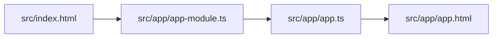

# Angular App. Initial Load

File = src/index.html

```html
<!doctype html>
<html lang="en">
    <body>
        <!-- Custom Angular tag.-->
        <!-- Replace this tag/selector with the template of the component-->
         <!--Similar to an "include" -->
        <app-root></app-root>
    </body>
</html>
```

# Where is the `<app-root>` defined?

File = src/app/app.component.ts
```typescript
import { Component } from '@angular/core';

// @Component is a DECORATOR (similar to Java annotations)
@Component({
    selector: 'app-root',
    templateUrl: './app.component.html',
    styleUrls: ['./app.component.css']
})
export class AppComponent {
    title = 'my-first-angular-project';
}
```

This is the content (templateURL) that will be included at 
that given location:
File = src/app/component.html
```html
<span>{{ title }} app is running! SUCCESS!!!</span>
```

## Step-by-Step Initial File Load



You can add properties in the `app.ts` (component) file:

File = src/app/app.ts
```typescript
import { Component, signal } from '@angular/core';

@Component({
  selector: 'app-root',
  templateUrl: './app.html',
  standalone: false,
  styleUrl: './app.css'
})
export class App {
  protected readonly title = signal('my-first-angular-project');

  firstName: string = "Rodrigo";
  lastName: string = "Hurtado";
}
```

and then use these properties in the src/app/app.html file.